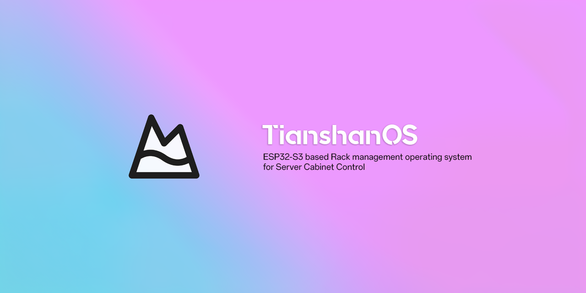
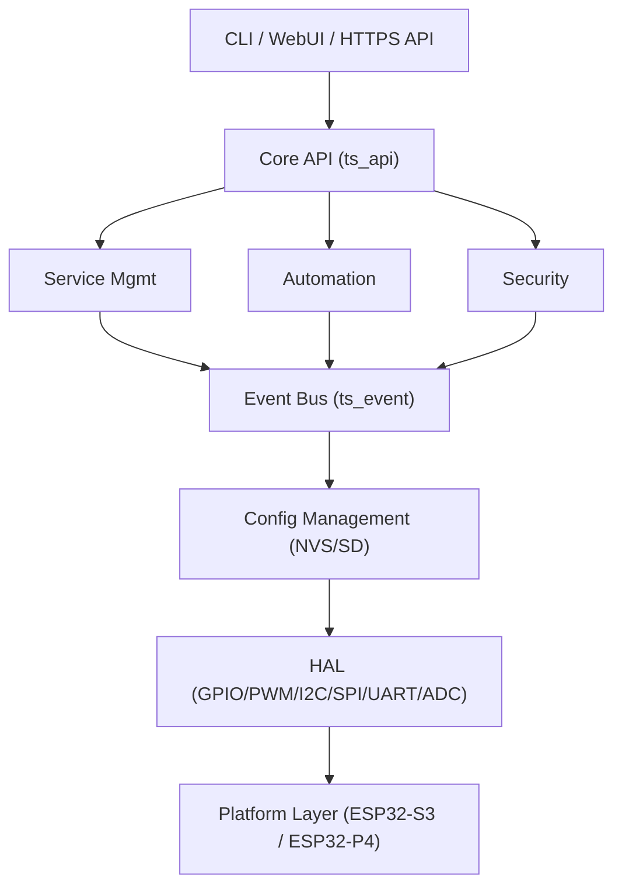

[English](README_EN.md) | [中文](README.md)

[](https://github.com/thomas-hiddenpeak/TianshanOS/actions/workflows/build.yml)
[](https://github.com/thomas-hiddenpeak/TianshanOS/releases/latest)
[](LICENSE)


> Tianshan Operating System - ESP32 Rack Management Operating System
> 
> Tianshan controls both the northern and southern basins — northward to AGX for AI computing power, southward to LPMU for general computing and storage services

---

## Project Overview

TianshanOS is a **configuration-oriented rather than code-oriented** embedded operating system framework, developed based on ESP-IDF v5.5+, designed for rack management of NVIDIA Jetson AGX + DFRobot LattePanda Mu carrier boards.

### Core Features

- **Fully Modular** - 220+ C source files, 110+ header files, 18 independent components
- **Configuration-Oriented** - Define hardware pins and system behavior through JSON configuration files
- **Unified Configuration System** - SD card priority + NVS backup dual-write, supports hot-swap sync, Schema version migration
- **Automation Engine** - Data source collection, rule engine, action execution, variable system
- **OTA Upgrade** - HTTPS/SD card dual-channel firmware upgrade with automatic rollback protection
- **Cross-Platform Design** - Supports ESP32-S3 and ESP32-P4
- **Security First** - HTTPS/mTLS, SSH public key authentication, PKI certificate management, tiered permissions
- **Unified Interface** - CLI and WebUI share Core API with consistent behavior
- **Multi-Language Support** - Chinese and English interface support

### System Architecture



---

## Project Structure

```
TianshanOS/
├── components/              # ESP-IDF Components (18 total)
│   ├── ts_core/            # Core Framework (config/event/service/log)
│   ├── ts_hal/             # Hardware Abstraction Layer (GPIO/PWM/I2C/SPI/UART/ADC)
│   ├── ts_console/         # Console (commands/multi-language/script engine)
│   ├── ts_api/             # Core API (unified interface layer)
│   ├── ts_automation/      # Automation Engine (datasource/rules/actions/variables)
│   ├── ts_led/             # LED System (WS2812/layers/effects/filters)
│   ├── ts_net/             # Networking (WiFi/Ethernet/DHCP/NAT/HTTP)
│   ├── ts_security/        # Security (SSH client/auth/encryption/SFTP)
│   ├── ts_https/           # HTTPS Server (mTLS/API gateway)
│   ├── ts_cert/            # Certificate Management (generate/issue/verify)
│   ├── ts_pki_client/      # PKI Client (certificate request/renewal)
│   ├── ts_webui/           # WebUI (REST API/WebSocket/dashboard)
│   ├── ts_storage/         # Storage (SPIFFS/SD card/file operations)
│   ├── ts_ota/             # OTA Upgrade (HTTPS/SD card/rollback)
│   ├── ts_drivers/         # Device Drivers (fan/power/AGX/temperature)
│   └── ts_jsonpath/        # JSONPath Parser
├── boards/                 # Board Configurations (pins.json/services.json)
├── main/                   # Main Program Entry
├── docs/                   # Documentation
├── sdcard/                 # SD Card Content Template
├── partitions.csv          # Partition Table (factory 3MB + storage)
└── sdkconfig.defaults      # Default Configuration
```

---

## Development Environment

### Dependencies
- ESP-IDF v5.5.2+
- Python 3.10+
- CMake 3.16+

### Quick Start

```bash
# Clone the repository
git clone https://github.com/thomas-hiddenpeak/TianshanOS.git
cd TianshanOS

# Set up ESP-IDF environment
. $HOME/esp/v5.5/esp-idf/export.sh

# Set target chip
idf.py set-target esp32s3

# Configure project (TianshanOS options are in the top-level menu)
idf.py menuconfig

# Build
idf.py build

# Flash and monitor
idf.py -p /dev/ttyACM0 flash monitor
```

### VS Code Development

Using the ESP-IDF extension is recommended, which supports one-click build/flash/monitor, Menuconfig GUI, code completion and navigation.

For detailed instructions, please refer to the [Quick Start Guide](docs/QUICK_START.md).

---

## Documentation

| Document | Description |
|----------|-------------|
| [Quick Start](docs/QUICK_START.md) | Environment setup and first run |
| [Architecture Design](docs/ARCHITECTURE_DESIGN.md) | System architecture and design decisions |
| [Config System Design](docs/CONFIG_SYSTEM_DESIGN.md) | Detailed design of unified configuration system |
| [Automation Engine](docs/AUTOMATION_ENGINE.md) | Trigger-condition-action system |
| [GPIO Pin Mapping](docs/GPIO_MAPPING.md) | Hardware pin definitions and PCB mapping |
| [API Design](docs/API_DESIGN.md) | REST API architecture and design philosophy |
| [API Reference](docs/API_REFERENCE.md) | REST API and CLI commands |
| [Command Specification](docs/COMMAND_SPECIFICATION.md) | CLI command format specification |
| [Board Configuration](docs/BOARD_CONFIGURATION.md) | Pin and service configuration guide |
| [LED Architecture](docs/LED_ARCHITECTURE.md) | LED system multi-device multi-layer architecture |
| [Security Implementation](docs/SECURITY_IMPLEMENTATION.md) | SSH, PKI, authentication mechanisms |
| [Development Progress](docs/DEVELOPMENT_PROGRESS.md) | Feature implementation status tracking |
| [Test Plan](docs/TEST_PLAN.md) | Testing strategy and use cases |
| [Troubleshooting](docs/TROUBLESHOOTING.md) | Common issues and solutions |

---

## Current Status

**Version**: 0.3.0  
**Phase**: Phase 20 Complete - Automation Engine, SSH Remote Execution, Variable System

### Completed Features

| Module | Features |
|--------|----------|
| Core Framework | Configuration management, event bus, 8-stage service management, logging system |
| Configuration System | SD card priority + NVS backup dual-write, hot-swap sync, Schema version migration |
| Hardware Abstraction | GPIO, PWM, I2C, SPI, UART, ADC |
| LED System | WS2812 driver, multi-device multi-layer, effects engine, BMP/PNG/JPG/GIF |
| Console | Command system, multi-language, script engine, configuration persistence |
| Networking | WiFi, Ethernet W5500, HTTP/HTTPS server |
| Security | Session management, Token authentication, AES-GCM, RSA/EC, SSH client, PKI certificate management |
| Drivers | Fan control, power monitoring (ADC/INA3221/PZEM), AGX/LPMU power control, USB MUX |
| WebUI | REST API gateway, WebSocket broadcast, frontend dashboard |
| OTA | Dual-partition upgrade, version detection, integrity verification, automatic rollback |
| Automation Engine | Trigger-condition-action system, SSH remote execution, regex parsing, variable system |

### Automation Engine Features

- **Data Sources**: Timer, SSH command output, system metrics, GPIO, variables, HTTP
- **Triggers**: Threshold, regex matching, time expressions, change detection
- **Actions**: Variable setting, command execution, event publishing, logging
- **SSH Integration**: Supports continuous monitoring commands (e.g., `ping`), real-time variable updates

### Unified Configuration System Features

- **7 Configuration Modules**: Network, DHCP, WiFi, LED, Fan, Device, System
- **Dual-Write Sync Mechanism**: NVS + SD card simultaneous write ensures consistency
- **Hot-Swap Handling**: Mark as `pending_sync` during SD card removal, auto-sync on insertion
- **Priority Management**: Memory cache > SD card > NVS > Schema defaults
- **Sequence Number Mechanism**: No RTC required, uses monotonically increasing sequence numbers to determine configuration versions
- **Schema Migration**: Supports configuration format upgrades and backward compatibility
- **Explicit Persistence**: CLI modifications are temporary by default, use `--save` for explicit persistence

See [Development Progress](docs/DEVELOPMENT_PROGRESS.md) for detailed status.

---

## Contributors

- Thomas (Project Lead)
- massif-01
